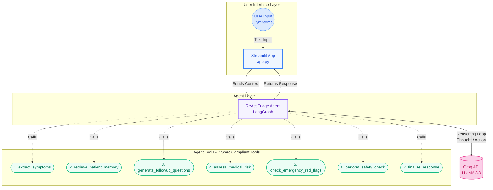

# Smart Triage AI Architecture

Here is the visual representation of the architecture we built.

```mermaid
graph TD
    %% Styling
    classDef ui fill:#eff6ff,stroke:#3b82f6,stroke-width:2px,color:#1d4ed8
    classDef user fill:#dbeafe,stroke:#3b82f6,color:#1d4ed8
    classDef agent fill:#f5f3ff,stroke:#8b5cf6,stroke-width:2px,color:#5b21b6
    classDef llm fill:#fbcfe8,stroke:#ec4899,stroke-width:2px,color:#be185d
    classDef tool fill:#ecfdf5,stroke:#10b981,color:#047857

    %% UI Layer
    subgraph UI_Layer [User Interface Layer]
        User((User Input<br/>Symptoms)):::user
        Streamlit[Streamlit App<br/>app.py]:::ui
    end

    %% Agent Layer
    subgraph Agent_Layer [Agent Layer]
        ReAct[ReAct Triage Agent<br/>LangGraph]:::agent
    end

    %% LLM
    LLM[(Groq API<br/>LLaMA 3.3)]:::llm

    %% Tools Layer
    subgraph Tools_Layer [Agent Tools - 7 Spec Compliant Tools]
        T1([1. extract_symptoms]):::tool
        T2([2. retrieve_patient_memory]):::tool
        T3([3. generate_followup_questions]):::tool
        T4([4. assess_medical_risk]):::tool
        T5([5. check_emergency_red_flags]):::tool
        T6([6. perform_safety_check]):::tool
        T7([7. finalize_response]):::tool
    end

    %% Relationships
    User -->|Text Input| Streamlit
    Streamlit -->|Sends Context| ReAct
    ReAct -->|Returns Response| Streamlit
    
    ReAct <-->|Reasoning Loop<br/>Thought / Action| LLM

    ReAct -.->|Calls| T1
    ReAct -.->|Calls| T2
    ReAct -.->|Calls| T3
    ReAct -.->|Calls| T4
    ReAct -.->|Calls| T5
    ReAct -.->|Calls| T6
    ReAct -.->|Calls| T7

```
